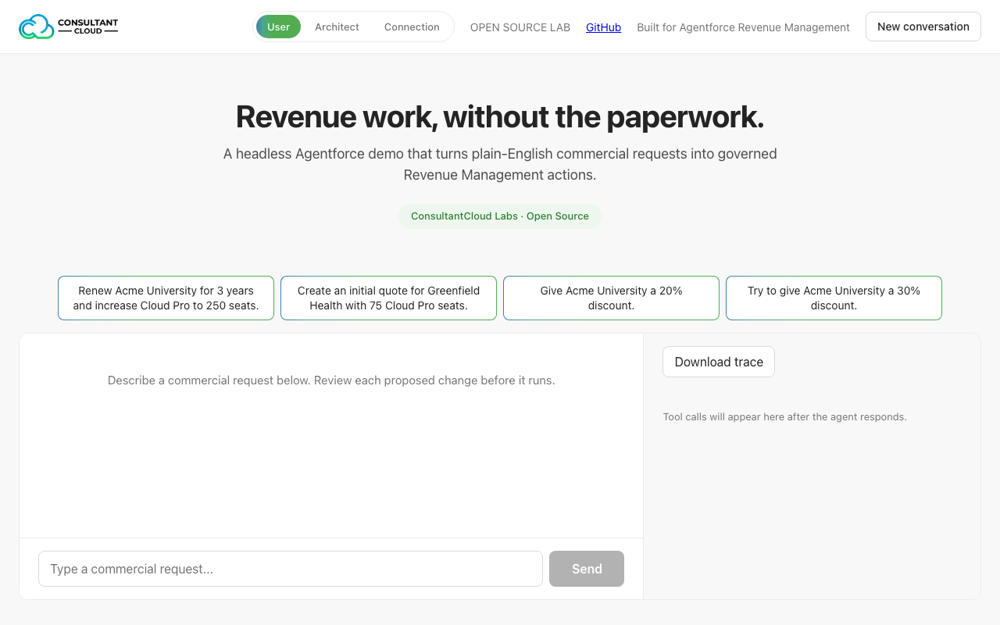
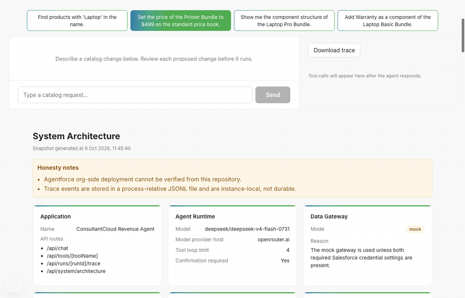
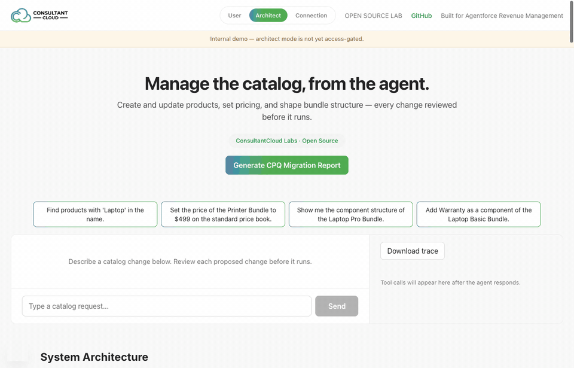

# ConsultantCloud Revenue Agent

[](https://github.com/fizzy2562/ConsultantCloud-Revenue-Agent/actions/workflows/ci.yml)
[](LICENSE)

**An open-source agent for Salesforce Agentforce Revenue Management (Revenue Cloud).** Ask for a
renewal, a quote or a discount in plain English. The agent works out the steps and reads what it
needs from Salesforce. It then shows you exactly what it's about to change, and changes nothing
until you confirm. Discount limits and approvals are enforced by code, not by the prompt.



> Independent open-source project. Not affiliated with or endorsed by Salesforce.

## What it does

**For sellers (User mode)**
- Renewals, new quotes, amendments, quantity and term changes, from one sentence.
- A confirmation card for every change, listing the exact account, products and terms.
- Discount guardrails: up to 15% goes through, 15–25% needs a named approver, and over 25% is
  refused. All three are enforced in `packages/policy`, whatever the model says.
- A live trace of every tool call, which you can download as an audit record.

**For architects (Architect mode)**
- Catalog work by chat: find and create products, set prices, inspect and change bundle structure.
- **CPQ → Revenue Cloud migration report.** It connects read-only to a Salesforce CPQ org and runs
  13 inspectors: price and product rules, discount schedules, QCP scripts, twin fields, the catalog,
  the installed base, selling models, usage, automation, integrations and reporting. The result is a
  migration assessment you can export as a PDF, with a blast radius and a testing and cutover plan.
  It is assembled by rules, not by an LLM: see
  [an example report](docs/cpq-to-revenue-cloud-migration-report.md).

| Inspect a bundle in a live Revenue Cloud org | Run the CPQ migration report on a live CPQ org |
|---|---|
|  |  |

Both recordings are against real Salesforce orgs. Waits for the model and the org are sped up.

**Where you can use it**
- **The web app** (`apps/web`), with Salesforce OAuth sign-in for your Revenue Cloud and CPQ orgs.
- **Slack:** `/quickpick` opens a quote and configures its bundles step by step, without leaving
  Slack.
- **Agentforce:** the same 46 tools as Agentforce actions, through a REST bridge
  ([setup](docs/agentforce-setup.md)), and a Quote Assistant chat component for Lightning record
  pages ([setup](docs/quote-assistant-lightning.md)).
- **Any MCP client:** `packages/revenue-mcp` is a standalone MCP server.

## Try it in five minutes

No Salesforce org is needed: without one, the app uses built-in demo data (Acme University and
Greenfield Health, both fictional).

```bash
pnpm install
cp .env.example apps/web/.env      # then set LLM_API_KEY (an OpenRouter key works)
pnpm --filter @consultantcloud/web dev
```

Open http://localhost:3000 and click one of the starter prompts.

**Model.** Any OpenAI-compatible API works (`LLM_API_URL`, `LLM_MODEL`). The default,
`deepseek/deepseek-v4-flash-0731` on OpenRouter, handles multi-step tool calling reliably at about
$0.0003 a call. Small free models tend to stall partway through a plan.

**Your own org.** Sign in on the Connection tab (OAuth, set up in `.env.example`). Locally you can
use static tokens instead: `SF_INSTANCE_URL` and `SF_ACCESS_TOKEN`. Recreate the demo data with
`sf apex run --file salesforce/scripts/setup-demo-data.apex --target-org <alias>`.

**Docker:** see [docs/docker.md](docs/docker.md).

## How it's built

```
apps/web                      Next.js app: chat, trace, Architect mode, OAuth, Slack, REST bridge
packages/agent-runtime        The live agent: discovers the MCP tools, plans with the LLM, gates changes
packages/revenue-mcp          MCP server: 46 tools over a Salesforce gateway, or a mock gateway
packages/policy               Discount bands, confirmation rules, idempotency, retries, circuit breaker
packages/shared               Zod schemas, types, the gateway interface and the mock gateway
packages/cpq-analysis         CPQ inspectors and the rules-based migration report
packages/telemetry            Structured event log and metrics
packages/quickpick-*          Bundle configuration for Slack (vendored from revenue-picker)
evals                         Scenario suite run against the real MCP server
force-app                     Agentforce agent bundles, and the Quote Assistant LWC and Apex
```

**The rule it's built on: the model decides what should happen; deterministic code decides whether
it's allowed.**
- The runtime, not the model, decides whether a change runs. It sets `confirmedByUser` and the
  idempotency key itself, whatever the model puts in a tool call.
- Every ID in a change has to come from an earlier tool result in the same run, so the model
  can't invent an account or a product.
- Discount bands are data in `packages/policy`, never prompt text.

**Quality.**
- **CI** runs the build, 200+ unit tests, the eval suite, `pnpm audit` and a gitleaks secrets scan
  on every push.
- **Evals:** the scenarios are in `evals/cases/scenarios.ts`. One is skipped, honestly, because
  it needs a live model.
- **Reviews:** a red-team pass, and two independent code reviews whose findings were all fixed.
  See [docs/tickets](docs/tickets) for the full build log, defects included.
- **Security:** see [docs/security.md](docs/security.md).

## How this was built

The application code was written by AI models working ticket by ticket from
[the spec](docs/PROJECT_SPEC.md):
- a local Qwen model built the first version;
- Codex built the live agent runtime and ran the independent reviews;
- Claude Code wrote the specs, reviewed the code and integrated it.

[docs/tickets](docs/tickets) records what each one built, and the defects each one introduced and
how they were caught.

## Known limits

- `approvedBy` for the approval band is a recorded name, not a verified identity.
- On a real org, adding quote lines depends on Salesforce's product discovery index having picked
  up new products.
- Production use needs a dedicated integration user with JWT Bearer or Client Credentials, not a
  user's session. See [docs/security.md](docs/security.md).

## Contributing

See [CONTRIBUTING.md](CONTRIBUTING.md). Please report security issues privately: see
[SECURITY.md](SECURITY.md).

## License

[MIT](LICENSE)
